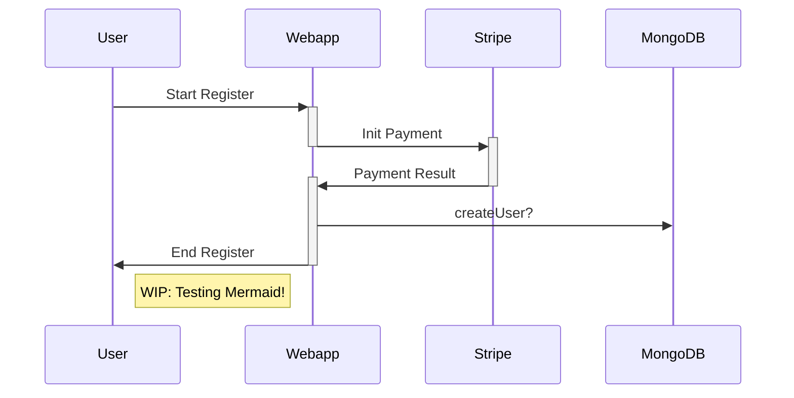
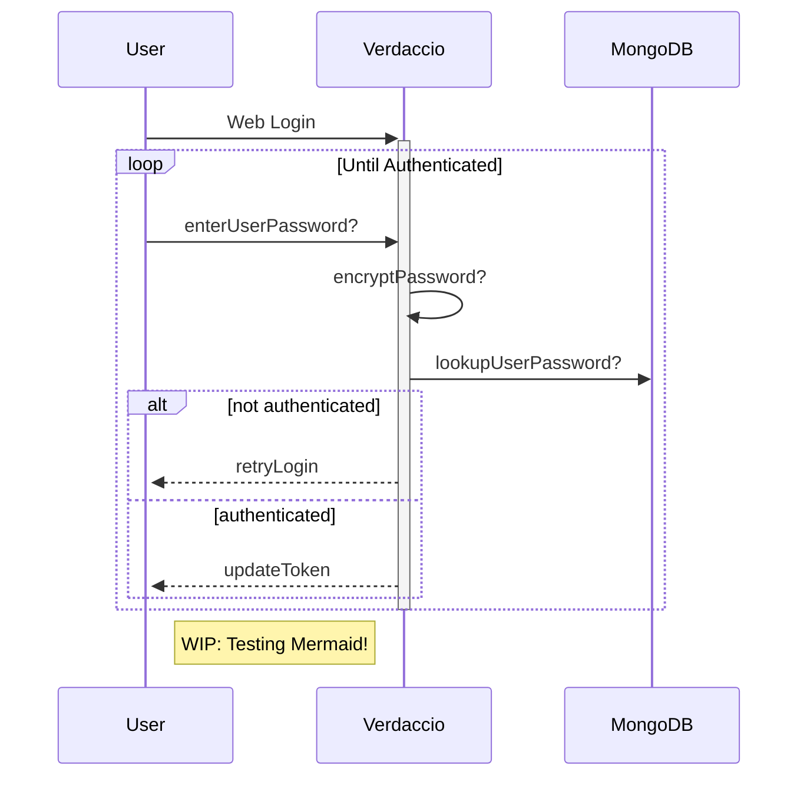

# verdaccio-auth-mongodb

> WARN: Work in progress

> The MongoDB Authentication plugin for Verdaccio

This plugin enables you to use a MongoDB or compatible database (e.g., AWS DocumentDB - currently, compatible to MongoDB 3.6 and 4.0) as the store for your user data. 
This is especially useful if you want to use an existing user database, if you want to store additional information with the users, or if you want to create users from an external system.

## Installation

### Install MongoDB auth plugin into Verdaccio

Add the MongoDB auth plugin to your Verdaccio installation like this:

```shell
npm install -g verdaccio-auth-mongodb
```

### Setup Database

1. Create a MongoDB (or DocumentDB, etc.)
2. Secure database with password, auth keys or secure VPN
3. Create user with correct roles, rights, and password
4. ...
5. Create indices as needed

## Configure Verdaccio to use MongoDB auth

Change the `auth` section in your `config.yaml` file to include the following. Replace the existing `auth` section or add it to an existing `auth` chain - but first replace placeholders with your specific values.

```yaml
auth:
  auth-mongodb:
    uri: "mongodb://[username:password@]host1[:port1]"
    db: "verdaccio"
    collection: "users"
    fields:
      username:   "username"
      password:   "password"
      usergroups: "usergroups"
    queries:
      add_user:    "{ username: '_USER_', password: '_PASS_', dateCreated: new Date() }"
      update_user: "{username: '_USER_'}, { '$set': {username: '_USER_', password: '_PASS_', dateCreated: new Date() }}"
      auth_user:   "{ username: '_USER_', password: '_PASS_' }"
```

Configuration options
* `uri`: The MongoDB-like URI [REQUIRED]
* `username`: The clear-text name of the admin user who has the necessary roles or rights to insert, update, delete(?), and lookup users in a specific collection (i.e., [user-collection]). [OPTIONAL?]
* `password`: The `bcrypt` encrypted password of the admin user [OPTIONAL?]
* `database`: The database in the MongoDB holding the user collection [OPTIONAL?]
* `queries`: (based on MongoDB syntax with _USER_ and _PASS_ placeholders)
  * `add_user`: Command to create a user in the database [OPTIONAL?]
  * `update_user`: Command to update a user (esp. for new passwords) [OPTIONAL?]
  * `auth_user`: Command to check if a user and password combination exists in the database [REQUIRED]

## development

See the [Verdaccio contributing guide](https://github.com/verdaccio/verdaccio/blob/master/CONTRIBUTING.md) for instructions setting up your development environment. 
Once you have completed that, use the following npm tasks.

  - `npm run build`

    Build a distributable archive

  - `npm run test`

    Run unit test

For more information about any of these commands run `npm run ${task} -- --help`.

# Usage Concept

## Register Users


## Authenticate Users


